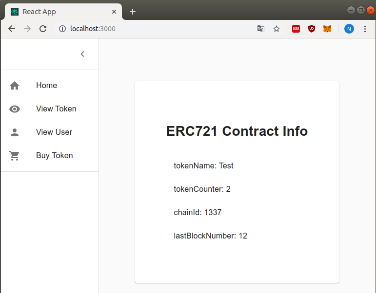
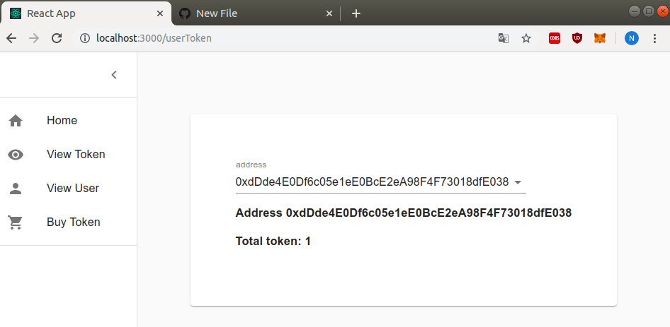
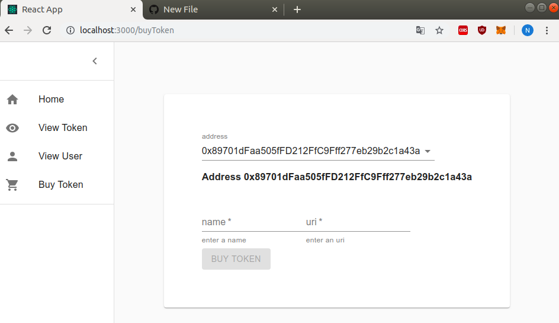

# TD7_Monnaie_Numerique
Repository of Nicolas Matusiak and Nicolas Lecouflet for the TD7 of "Monnaies Numériques"

## Functional ERC721 token 
Contract with a function to get the name of the token registry, a counter to show total number of created token and a mint() function to mint new tokens to anyone paying 0.1 ETH

--> [ERC721 Token](https://github.com/nlecoufl/TD7_Monnaie_Numerique/blob/master/contracts/Token.sol)

Deploy with
    
    truffle migrate 
    
Deployment file [2_deploy_contracts.js] (https://github.com/nlecoufl/TD7_Monnaie_Numerique/blob/master/contracts/Token.sol).
We deploy the contract and then mint 2 tokens with their corresponding image :

    let tokenName = "Test";

    let name1 = "dog";
    let uri1 = "https://imgur.com/gallery/i78hv1I";

    let name2 = "cats";
    let uri2 = "https://imgur.com/gallery/nrT50Wo";

    module.exports = (deployer, _, accounts) => {
      deployer.deploy(Token, tokenName).then(TokenInstance => {
        TokenInstance.mint(name1, uri1, {
          value: "100000000000000000"
        });
        TokenInstance.mint(name2, uri2, {
          from: accounts[1],
          value: "100000000000000000"
        });
      });
    };
    
## React App
Run with

    npx create-react-app client
    cd client
    npm start
    
Start a webpage to display the token registry name, the total token number, the chainId and the last block number

Webpage to display the token characteristics 

Webpage to display the user tokens

Webpage to display buy tokens

